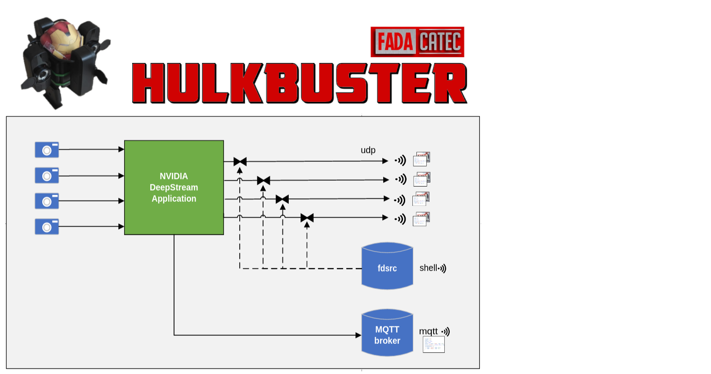

# NVDS-Hulkbuster

The Hulkbuster is a feature-rich Nvidia Deepstream sample application for object detection.




## Contents

[TOC]


## The Hulkbuster app

*"Back off! You're steaming up my a̶r̶m̶o̶r̶ Jetson!" - Hulkbuster*

The main Deepstream application. Beefy Nvds pipeline with the following features:

- Fully C-written implementation
- Multiple `v4l2src` input sources
- Yolo inference engine through `DeepStream-Yolo` tool
- Custom CLI for live pipeline control through custom CLI `(◐ . ◐ )`
- Object detection results
    - Sent to MQTT via `gst-nvmsgbroker`
    - Attached to video frames as udp-ready metadata via rtp headers `\(◐ O ◐\)`

#### Dependencies

- Ubuntu: Runs out of the box in a NVDS-Lite environment. Host must have `mosquitto`.
- Jetson: *UNTESTED*

#### Running the application

- Pre-launch setup:
    - Arrange your camera v4l2 `/dev/videoX` ids in `hulkbuster/src/main.c`
    - In a side terminal, **launch mosquitto** at the right port (see `hulkbuster/src/main.c`, default 1234). 
    - Log into NVDS container OR match dependencies (former is assumed):
    ```
    user@host:nvds-hulbuster$ nvds-lite
    root@nvds:/# cd /host/
    root@nvds:/host/# 
    ```
- Build application: `# make` (cleanup with `make clean`)
- Run application: `# ./hulkbuster.o`
- Live pipeline interaction:
    - Sending any input through STDIN to the hulkbuster app reveals a controller CLI
    - Write in `help` to see available pipeline-altering commands

If the NVDS-Lite container messes your permissions on exit, restore them with `$ chown -R "$USER" *`.

## The Receiver app

*"I'm Iron Man! Let's get this s̶h̶o̶w̶ meta  on the road." - Tony GStark*

Complementary app. Elementary Gstreamer pipeline that will take incoming UDP streams from the hulkbuster and drop their meta to its `stdout`.

#### Dependencies

- Gstreamer-1.0 install w/ rtp plugins
- Mosquitto

#### Running the application

- Make sure the UDP port matches the Hulkbuster's
- Build with `$ make` along with hulkbuster OR `$ pushd receiver && make && popd `
- Run with `$ ./receiver.o` OR `$ ./receiver/bin/receiver.o`
- Cleanup with `make clean`

## Utils
- `cams.sh`: Prompts v4l2-ctl for your available cameras and prints their `/dev/videoX` ready to copypaste into your C / bash script.  


## Novel pipeline elements

This section briefly discusses novel tools used to achieve the target features the Hulkbuster application aims for.

### The REMUX element 

A `#define`d compound artificial element worth mentioning. It concatenates the `nvstreammux` & `nvstreamdemux` elements and places valves in between. These valves allow stopping a UDP stream, yet keep inference and MQTT detections going on. While small, it does have a noticeable impact on performance. Should be used sparingly.

```
// in hulkbuster/src/main.c

#define REMUX \
    " nvstreamdemux name=demux                                           " \
    "     demux.src_0 ! valve name=remux_v0 drop=false ! remux.sink_0    " \
    "     demux.src_1 ! valve name=remux_v1 drop=false ! remux.sink_1    " \
    "     demux.src_2 ! valve name=remux_v2 drop=false ! remux.sink_2    " \
    "     demux.src_3 ! valve name=remux_v3 drop=false ! remux.sink_3    " \
    " nvstreammux name=remux nvbuf-memory-type=0                         " \
    "       batch-size="BATCH" width=640 height=640                      " \
    "       sync-inputs=1 batched-push-timeout=500000                    """
```

### File descriptor Controller 

A CLI alternative to GstDaemon, used to set / get properties of pipeline elements. Most useful to switch `valve` elements to control parallel video streams. The handling of streams and (mostly) meta required writing an app with Pad Probes, which are not supported by GstDaemon pipeline declaration. Usage instructions below:

- No install, just `#include` the files
    - `hulkbuster/src/gstfdcontrol.c`
    - `hulkbuster/include/gstfdcontrol.h`

- In your application, add this sub-pipeline: `fdsrc fd=0 name=control ! fakesink dump=false async=false`
    - `fdsrc`: file descriptor source
        - `fd=0`: sets `stdin` as source
        - `name=control`: alias for easier handling
    - `fakesink`: to discard processed buffers
        - `dump=false`: set to true *only* for debugging. Will dump all `fdsrc` received data to stdout.
        - `async=false`: drops the need for a pipeline preroll, which pauses the pipeline until first buffer (i.e. *whole* application would block until something comes through stdin)[source](https://gstreamer-devel.narkive.com/DN53mAgd/gst-devel-proper-usage-of-fdsink-and-fdsrc-out-of-process-processing)
- In your application, attach a `control_handler` probe pad to `fdsrc`: `place_probe(pipeline, "control", control_handler, pipeline);`
    - All text processing happens at `control_handler`
    - Pass a pointer to the pipeline as user data
    - See `place_probe` implementation in `./hulkbuster/src/main.c`
    - See `control_handler` implementation in `./hulkbuster/src/gstfdcontrol.c` 

Find an example usage snippet below. The following simulates the hulkbuster's output, `{}` denotes fake hints introduced to the reader.
```
{ DEEPSTREAM PIPELINE BOOT OUTPUT UP UNTIL HERE }
Running...
Adjusting muxer's batch push timeout based on FPS of fastest source to 33333
Adjusting muxer's batch push timeout based on FPS of fastest source to 33333
{ Press Enter }

>>> help
Gstreamer Control Handler.                      
                                                
Helper CLI for interacting with live pipelines. 
Your STDIN is being sent to Gstreamer.           
                                                
Usage:                                          
    set <element_name> <property_name> <value>  
    get <element_name> <property_name>          
    echo [args]                                 
    help                                        
    dummy                                       
                                                
Kill the pipeline with ^C to exit, as usual.    

>>> 
``` 

### Gst Custom meta 

Here's an overview on how UDP metadata transmission is achieved.

- Private deepstream metadata is generated by the `nvinfer` plugin 
- The detections in this struct are parsed to a string and moved to the more flexible GstMeta API
- Such string is attached to every last RTP packet encoding a frame

This approach is described in the following sample pipeline schematic:

```
                      video         video           application                               video
┌─────────┐  ┌──────┐ x-raw ┌─────┐ x-264 ┌───────┐ x-rtp         UDP  ┌─────────┐   ┌──────┐ x-raw
│ v4l2src ├─►│ NVDS ├───────│xh265├──────►│rtp*pay├─────────────── * ─►│rtp*depay├──►│decode├──────►
└─────────┘  └──────┘       └─────┘       └───────┘                    └─────────┘   └──────┘
                                    │ ▲               │ ▲                           │
                                    ▼ |               ▼ |                           ▼
                            NvdsMeta->GstMeta   GstMeta->rtp header        rtp header->stdout
```

See more on metadata at [NVDS-Meta](https://bitbucket.org/fadacatec-ondemand/nvds-meta/src/master/).


## Notes, references and such

Here are some resources found useful during the development of this repo. Meant for quick reference only.

### Gstreamer/NVDS issues

- Do not use single quotes in `gst-parse-launch` pipelines
- `nvmultistreamtiler` and `nvosd` can only be used once, else detections are corrupted / missplaced
- Setups with many USB cameras are not always stable:
    - Reference many usb cameras issues: [reference + fix](https://forums.developer.nvidia.com/t/use-gstreamer-to-open-two-usb-cameras-failed-to-allocate-required-memory/122843) 
    - Error information prompting these:
        - After pipeline tries to boot: `Failed to allocate required memory` -> *insist* running the same commands. 
        - Instantaneous `Segmentation fault` -> review your cameras `/dev/videoX` ids 
    - Lowering camera bandwidth usage reduces the frequency of these issues, however they do happen sometimes
    - Funky scenarios & advice:
        - You might be able to stream at 1080 one time, but not a second one. If you believe your pipeline should work but it fails to allocate memory, *insist*
        - 4 cameras sometimes seen to repeteadly fail on 640x480, but work on 1280x720 right after
        - If they fail at 1280x720, try at 800x600 then go back again to 1280x720
        - Rerun docker image after replugging cameras
- RidgeRun's Gstreamer debugging guide: [GStreamer Debugging](https://developer.ridgerun.com/wiki/index.php/GStreamer_Debugging) 
- RidgeRun's Gstreamer general advice and pointers: [Why RidgeRun loves GStreamer](https://developer.ridgerun.com/wiki/index.php/Why_RidgeRun_Loves_GStreamer) 
- `fdsrc` blocks the pipeline on start. Set its fakesink's `async=false` to avoid the need for prerolling. [source](https://gstreamer-devel.narkive.com/DN53mAgd/gst-devel-proper-usage-of-fdsink-and-fdsrc-out-of-process-processing)


### General networking

- Networking apps inside/outside of docker:
    - `mosquitto`: no known issues
    - `rtsp-simple-server`: will NOT properly connect endpoints if running in docker. 
- A few pipelines to quickly test udp
    - Send
    ```
    gst-launch-1.0 videotestsrc               \
        ! videoconvert                        \
        ! x264enc tune=zerolatency            \
        ! rtph264pay                          \
        ! udpsink host=127.0.0.1 port=1234    ;
    ```
    - Receive
    ```
    gst-launch-1.0 udpsrc port=1234                                              \
        ! application/x-rtp ! rtph264depay                                       \
        ! queue leaky=1 max-size-buffers=100 max-size-time=0 max-size-bytes=0    \
        ! h264parse config-interval=-1 ! avdec_h264                              \
        ! queue leaky=1 max-size-buffers=100 max-size-time=0 max-size-bytes=0    \
        ! videoconvert ! queue leaky=2 ! autovideosink sync=false async=false    ;
    ```
- Wiresharking the UDP streams: 
    - `sudo wireshark`
    - Loopback (lo)
    - Apply filter `udp.port==1234`
    - Run both wireshark and your app
    - See your custom RTP headers (if not encrypted)
        - Monitor the packages, find the last RTP of each frame and see the first dozen byte rows.
    - Diagnose pipeline bandwith usage:
        - Top bar Statistics -> I/O graphs
        - A new window with a graph will pop up
        - In the lower panel, select `All packets | * | Bytes | None`
  

### Novice C resources

- *Great* C reference manual: [Notes on Data Structures and Programming Techniques (CPSC 223, Spring 2022)](https://www.cs.yale.edu/homes/aspnes/classes/223/notes.html)
- Learn X in Y minutes C cheatsheet [Where X=C](https://learnxinyminutes.com/docs/c/)
- Compilation process issues:
    - Linker undefined: `/usr/bin/ld: /tmp/main.o: undefined reference to symbol 'WHATEVER'` -> missing libraries at `pkg-config --libs --cflags **`
    - What should I put in `pkg-config`? 
        - If facing linker error: `pkg-config --list-all | grep YOUR_HUNCH`
        - See this thread: [How are you supposed to know what library names are](https://stackoverflow.com/questions/48756209/how-are-you-supposed-to-know-what-library-names-are)


## Contribution guidelines

Tag any significant release as in: `whatever_tag[-nvdsVERSION]-platform`. Example `udpx4-nvds6.1-ubuntu` or `udpx4-nvds6.0-jetson`


## Reach out

Pablo Santana -> psantana@catec.aero

